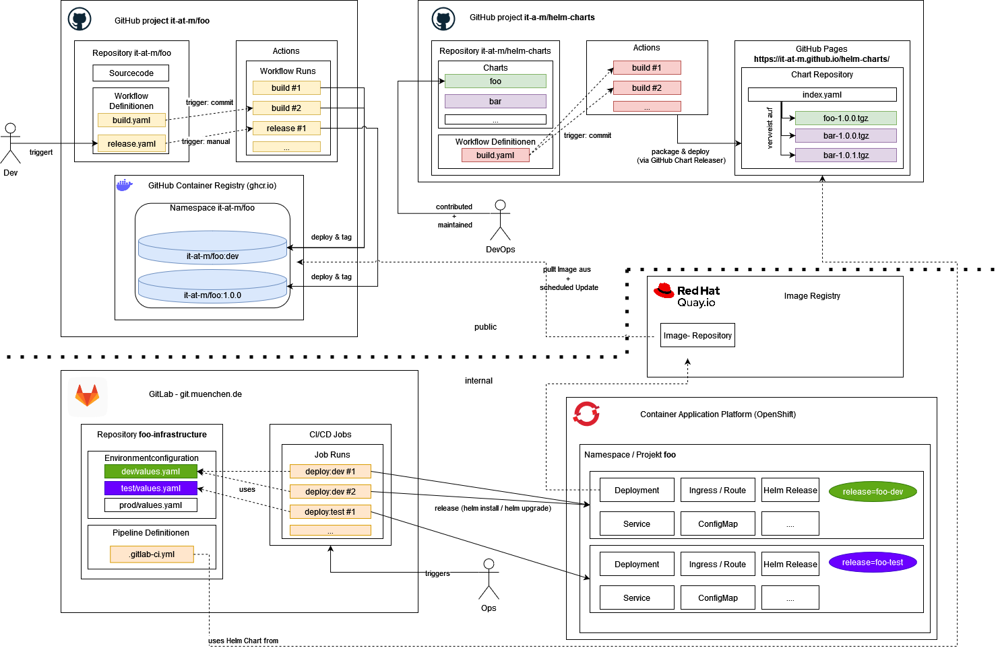

# Helm Chart

There is a sample chart. https://github.com/it-at-m/helm-charts/tree/main/charts/sps-sample . It consists of subcharts. Each subchart is a different module for example frontend, backend, eai.  Each module was created with `helm create` and some adaptions. The Chart.yml includes the external dependency of the apigateway. The main config is done in the values.yml of the parent chart. In the section refarch-gateway, frontend, backend you can set the config of the subchart. 

# Deployment

At the end of a sprint a developer builds a release in the source code project. It needs to be done for each folder frontend/backend/eai separately. Then the devops engineer needs to update the chart-version and app-version of the helm chart in the Chart.yaml.

Internal the quay syncs the docker images with the external github image registry. The github api has a pull limit so we need to cache the images internally.

The internal gitlab repo you can config your application, for example the trust store, ingress (openshift route), single sign on, database config, environment configs. The most config is comment out, so you need to comment it in. Here you see an example https://git.muenchen.de/ccse/cicd/sps-github

You have two possibilities for the image rollout. 
-	For the dev environment, you want to have an auto rollout. We create a image stream. The image stream has a link to the quay. In the deployment there is a special annotation set. Openshift then triggers automatically trigger a new rollout if a new image is available.  https://docs.redhat.com/en/documentation/openshift_container_platform/4.17/html/images/triggering-updates-on-imagestream-changes#triggering-updates-on-imagestream-changes

-	For the test, prod environment, you want to manual rollout. You need to specify the image version for each service in the values.yml.  You need to pay attention that you take the image from the internal quay and not from the github registry.
