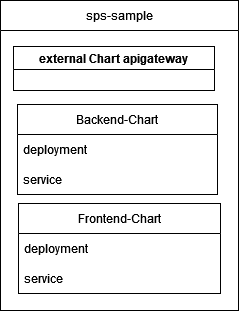
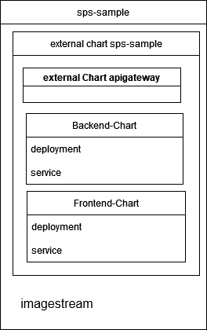

# Architecture-Overview

*The picture shows the architecture overview. The steps are explaind in the following passages*

# Source Repo

The top left from the architecture-overview is explaint in [link](./workflows.md).

# Helm Chart

The top right from the architecture-overview is explaint in the following.

We provide a sample chart. https://github.com/it-at-m/helm-charts/tree/main/charts/sps-sample, which consists subcharts. Each subchart is a different module for example frontend, backend, eai.  Each module was created with `helm create` and we made some adaptions. The Chart.yml includes the external dependency of the [RefArch Api Gateway Helm Chart](https://github.com/it-at-m/helm-charts/tree/main/charts/refarch-gateway). The main config is done in the values.yml of the parent chart. In the sections refarch-gateway, frontend, backend you can configure the subcharts. 

# Deployment

The bottom part from the architecture-overview is expliant in the following.

At the end of a sprint a developer builds a release in the source code project. It needs to be done for each folder frontend/backend/eai separately. Then the devops engineer needs to update the chart-version and app-version of the helm chart in the Chart.yaml.

Internal the quay syncs the docker images with the external github image registry. The github api has a pull limit so we need to cache the images internally. The configuration is done by the openshift team.

The internal gitlab repo you can config your application, for example the trust store, ingress (openshift route), single sign on, database config, environment configs. The most config is comment out, so you need to comment it in. Here you see an example https://git.muenchen.de/ccse/cicd/sps-github

You have two possibilities for the image rollout. 
-	For the dev environment, an automatic rollout is implemented. We create an image stream that links to internal Image Registry (Quay). The deployment includes a special annotation that prompts The internal kubernetes platform (Openshift) to automatically trigger a new rollout when a new image becomes available. For more details, see [this documentation](https://docs.redhat.com/en/documentation/openshift_container_platform/4.17/html/images/triggering-updates-on-imagestream-changes#triggering-updates-on-imagestream-changes).

-	For the other environment (test, prod), a manual rollout is implemented. You have to specify the image version for each service in the values.yml as well paying attention to use the image from the internal image registry and not from the GitHub Registry.
